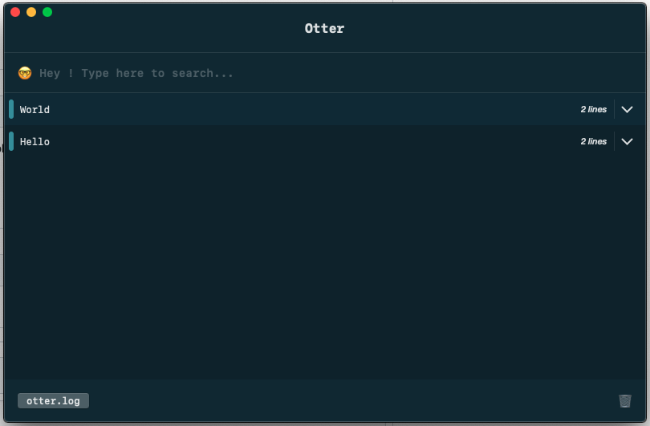

# otter
A simple &amp; friendly interface to get real time file logs.

## How it works
This is a macOS application. Select a **.log** file and it will parse it and search for otter tags.

A log is detected with the open tag **[otter]** and the close tag **[\otter]**.

#### Example :

    [otter]
    Hello
    [/otter]
    [otter]
    World
    [/otter]

*Result in otter :*

## Use with third party Logger

You can create the log file and fill it every time you log but there is already existing third party logger to do that. For example, [SwiftyBeaver](https://github.com/SwiftyBeaver/SwiftyBeaver).

#### Create a file destination :

*In AppDelegate :*

    import SwiftyBeaver
    let log = SwiftyBeaver.self
    let fileLog = FileDestination()

*In didFinishLaunchingWithOptions :*

    fileLog.format = "[otter]\n$DHH:mm:ss.SSS$d $M\n[/otter]"
    fileLog.logFileURL = URL(string: "/tmp/otter.log")
    log.addDestination(fileLog)

Now launch **Otter** and the logs will be displayed in real time.
